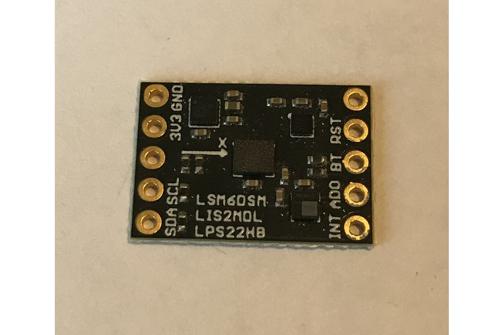

<a href="https://www.tindie.com/products/onehorse/max32660-motion-co-processor/"></a>

This repository derives from Greg Tomasch's [code](https://github.com/gregtomasch/USFSMAX) for the
[USFSMAX motion coprocessor](https://www.tindie.com/products/onehorse/max32660-motion-co-processor/).  
See Greg's library for details.

Changes I made to Greg's version:

* Made a proper Arduino repository

* Eliminated globals and #defines

* Moved all printout from library code to sketch

* Simplified arrays; e.g., ```gyroData[2][3]``` => ```gyroData[3]```

* Use [CrossPlatformDataBus](https://github.com/simondlevy/CrossPlatformDataBus) to support multiple host types
(Arduino, RaspberryPi, NVIDIA Jetson); work in progress
